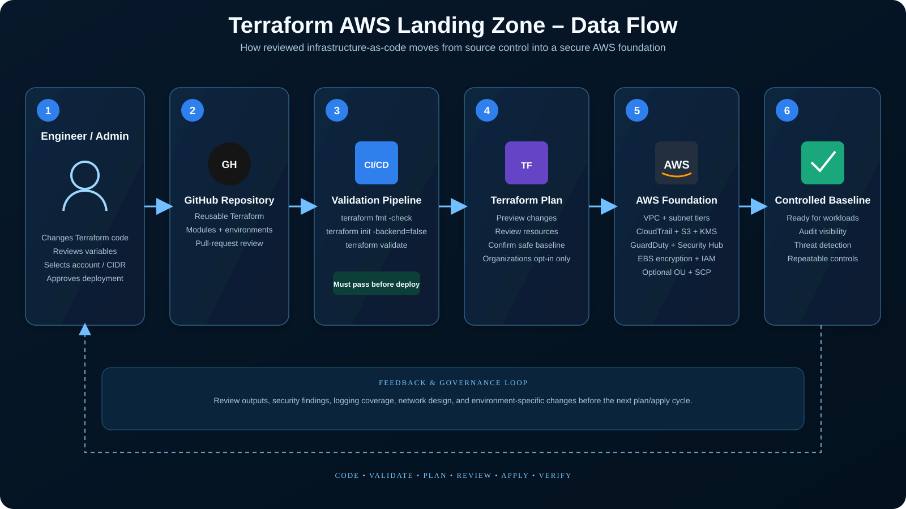
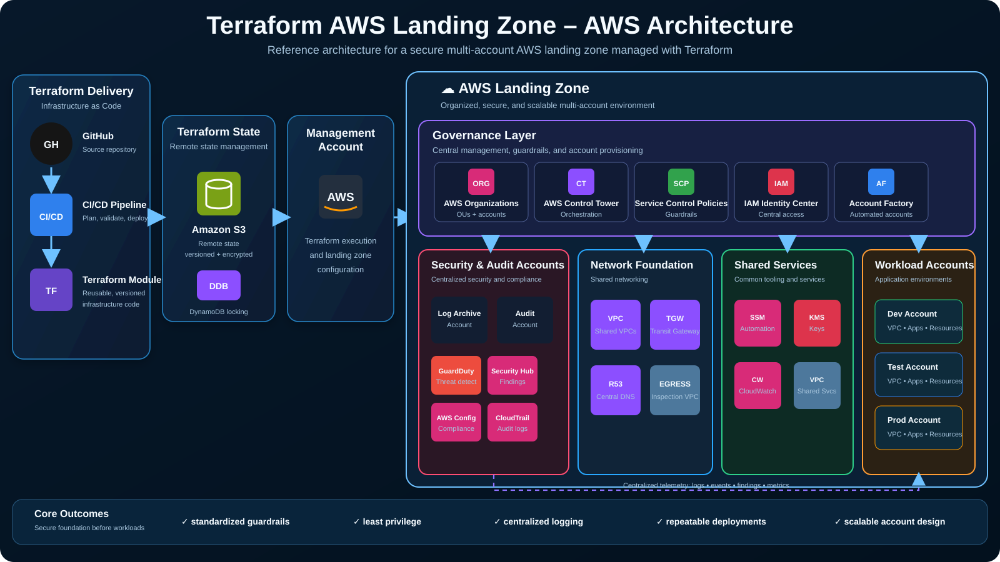
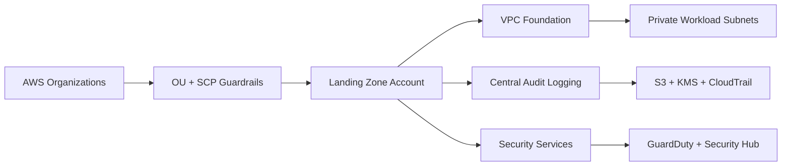

# Terraform AWS Landing Zone

A portfolio-grade AWS landing-zone reference implementation built with Terraform. The project establishes a secure cloud foundation before application workloads are deployed, with repeatable controls for governance, networking, logging, encryption, threat detection, and account-level security settings.

> This is a safe reference implementation. AWS Organizations resources are disabled by default so the project can be validated without changing an existing organization. Enable organization governance only from the AWS Organizations management account after reviewing the SCPs and variables.

## Visual architecture

### Data flow



### AWS architecture



The diagrams reflect the current reference implementation: reusable Terraform, CI validation, multi-AZ networking, encrypted audit logging, GuardDuty, Security Hub, EBS encryption, IAM controls, and optional AWS Organizations guardrails.

## What this project demonstrates

- Infrastructure as Code using reusable Terraform configuration
- Optional AWS Organizations OU and Service Control Policy guardrails
- Multi-AZ VPC foundation with public and private subnet tiers
- S3 Gateway VPC endpoint for private AWS service access
- Central audit-log S3 bucket with versioning, public-access blocking, lifecycle retention, and KMS encryption
- Multi-region AWS CloudTrail with log-file validation
- GuardDuty and Security Hub enablement
- Account-level EBS encryption by default
- IAM account password policy for any break-glass IAM users
- Consistent tagging and configurable region/network inputs
- Automated Terraform format and validation checks in GitHub Actions

## Architecture



## Project structure

```text
terraform-aws-landing-zone/
├── README.md
├── dashboard.html
├── docs/
│   ├── architecture.md
│   └── deployment-guide.md
├── terraform/
│   ├── versions.tf
│   ├── variables.tf
│   ├── main.tf
│   ├── network.tf
│   ├── logging.tf
│   ├── security.tf
│   ├── organizations.tf
│   ├── outputs.tf
│   └── terraform.tfvars.example
└── .github/workflows/terraform.yml
```

## Quick validation

```bash
cd terraform
terraform fmt -check -recursive
terraform init -backend=false
terraform validate
```

## Deployment workflow

1. Review `terraform/terraform.tfvars.example` and choose a dedicated AWS account and CIDR range.
2. Authenticate to AWS with an approved short-lived role or SSO session.
3. From `terraform/`, run `terraform init`, `terraform plan`, and review the plan.
4. Apply first with `enable_organizations = false` to build the account-level foundation.
5. If you are in the AWS Organizations management account and intend to manage the organization, review the SCP and then set `enable_organizations = true`.
6. Store production Terraform state in an encrypted remote backend with locking. The portfolio project intentionally does not auto-create or auto-use a backend.

## Security design decisions

- **No long-lived AWS keys are required by the project.** Use AWS IAM Identity Center, role assumption, or GitHub OIDC for real deployments.
- **AWS Organizations changes are opt-in.** This prevents an example project from unexpectedly changing a production organization.
- **Audit storage is private, versioned, encrypted, and protected from public access.**
- **CloudTrail is multi-region and log-file validation is enabled.**
- **EBS encryption is enabled by default.**
- **GuardDuty and Security Hub provide baseline threat detection and posture visibility.**
- **Network tiers are separated into public and private subnets across multiple Availability Zones.**

## Portfolio status

The Terraform source, documentation, architecture dashboard, and CI validation workflow are implemented. Actual AWS deployment is intentionally manual and environment-specific because organization/account IDs, networking ranges, and governance decisions must be selected by the owner of the AWS environment.

Portfolio: https://dumm.cloud
