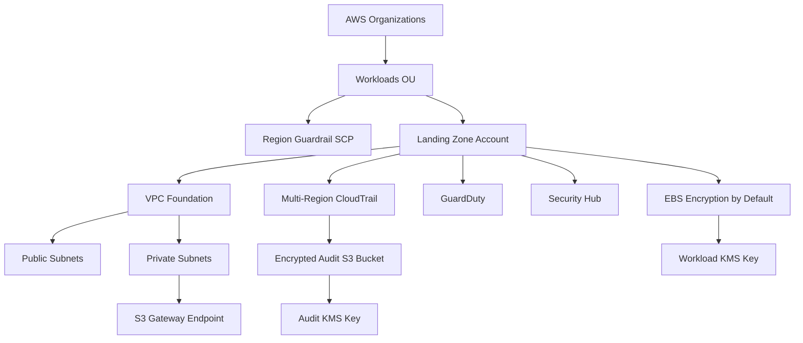

# Terraform AWS Landing Zone Architecture

## Objective

The landing zone establishes security and governance controls before application teams deploy workloads. It provides a repeatable baseline that can be reviewed, versioned, tested, and promoted through normal infrastructure-as-code practices.

## Logical layers

### 1. Governance layer

The optional AWS Organizations configuration creates a workload Organizational Unit and attaches a region-restriction Service Control Policy. It is disabled by default because organization-level changes must be deliberate and should only be performed from the AWS Organizations management account.

### 2. Network layer

The VPC spans multiple Availability Zones and separates public and private subnet tiers. Public subnets receive a route to an Internet Gateway, while private subnets do not receive a default internet route. An S3 Gateway VPC endpoint provides private access to Amazon S3 from the private route table without requiring a NAT Gateway.

This portfolio implementation intentionally omits NAT Gateways to avoid creating recurring cost by default. A production design can add centralized egress, inspection, Transit Gateway, or Network Firewall depending on the enterprise architecture.

### 3. Audit and encryption layer

AWS CloudTrail is configured as a multi-region trail with global service events and log-file validation. Audit logs are delivered to a dedicated S3 bucket that has:

- KMS encryption
- bucket key support
- versioning
- public access blocked
- TLS-only bucket policy
- lifecycle transition and noncurrent-version retention

The project uses a dedicated KMS key for audit logs and a separate KMS key for workload EBS encryption.

### 4. Security services layer

The landing zone enables:

- Amazon GuardDuty
- AWS Security Hub
- EBS encryption by default
- a strong account-level IAM password policy for any emergency or break-glass IAM users

For production environments, IAM Identity Center and federated short-lived roles should be preferred over routine IAM users.

## Architecture flow

## Production extensions

A larger enterprise landing zone would commonly add:

- dedicated log archive and security tooling accounts
- AWS Control Tower account vending and controls
- IAM Identity Center permission sets
- centralized DNS and network services
- Transit Gateway or Cloud WAN
- AWS Network Firewall or third-party inspection
- AWS Config aggregators and conformance packs
- centralized Security Hub and GuardDuty administration
- backup policies and delegated administration
- remote Terraform state with encryption and locking
- CI/CD deployment through short-lived OIDC roles

The portfolio project focuses on a deployable account-level baseline while clearly showing how the design expands into a multi-account enterprise landing zone.
